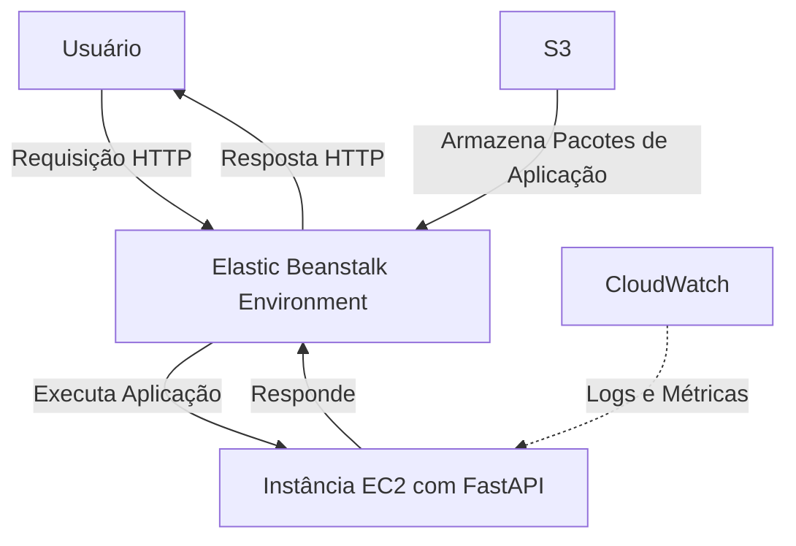

 # API de Consulta a dados da Vitivinicultura - Tech Challenge FIAP - ML Engineer - 2024

## Visão Geral

Este projeto fornece uma API para consultar dados de uva, vinho e derivados, incluindo exportações, importações, processamento, produção e informações de comércio. 
Ele é construído usando o framework FastAPI e utiliza arquivos CSV, extraidos do portal vitibrasil.cnpuv.embrapa.br como fontes de dados.

## Discussão

Como o próprio portal da embrapa entrega os arquivos em formato CSV, não houve necessidade de criação de webscrappers.

## Deploy

A API será hospedada na AWS, com o serviço gerenciado Elastic Beanstalk, que já prevê de forma nativa a criação de um bucket S3 gerenciado para armazenamento dos pacotes da aplicação e uma solução de monitoramento de logs via CloudWatch.

Abaixo MVA (gerado com mermaid):

## Funcionalidades

- Recuperar dados de exportação de vinho
- Recuperar dados de importação de vinho
- Recuperar dados de processamento de vinho
- Recuperar dados de produção de vinho
- Recuperar dados de comércio de vinho

## Endpoints
### Exportações de Vinho
GET /api/v1/wine-exports
Resposta: array JSON de dados de exportação de vinho.

### Importações de Vinho
GET /api/v1/wine-imports
Resposta: array JSON de dados de importação de vinho.

### Processamento de Vinho
GET /api/v1/wine-processing
Resposta: array JSON de dados de processamento de vinho.

### Produção de Vinho
GET /api/v1/wine-production
Resposta: array JSON de dados de produção de vinho.

### Comércio de Vinho
GET /api/v1/wine-trades
Resposta: array JSON de dados de comércio de vinho.

## Injeção de Dependência
A aplicação usa o sistema de injeção de dependência do FastAPI para fornecer os serviços e repositórios necessários. As dependências são definidas em app/di/dependencies.py.

## Modelos
Os modelos de dados são definidos usando Pydantic nos seguintes arquivos:
- app/domain/wine_exports/model/exports.py
- app/domain/wine_imports/model/imports.py
- app/domain/wine_processing/model/processing.py
- app/domain/wine_production/model/production.py
- app/domain/wine_trades/model/trades.py

## Repositórios

Os repositórios baseados em CSV são implementados para buscar dados de arquivos CSV. Eles estão localizados em app/infrastructure/repositories:
- csv_wine_exports_repository.py
- csv_wine_imports_repository.py
- csv_wine_processing_repository.py
- csv_wine_production_repository.py
- csv_wine_trades_repository.py

- Serviços
A lógica de serviço principal é implementada em app/domain/*/service/core.py para cada domínio.

